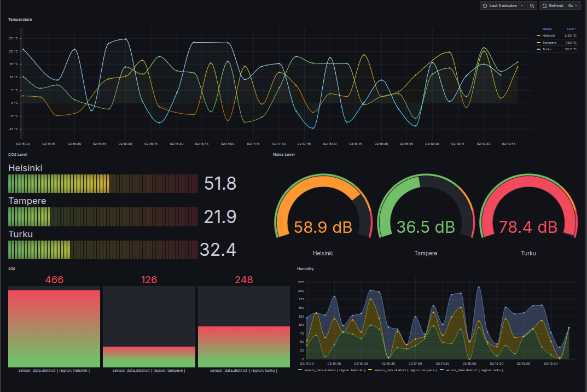

# Real-Time IOT Data Visualisation

**Group Members:**  
Moinul Laskar (2404679) & Nicolas Ragnell (39168)

---

## Project Overviews

As smart cities evolve, efficient and scalable monitoring of environmental parameters such as temperature, humidity, and noise is essential. This project aims to build a system that simulates multiple IoT devices generating sensor data in parallel, processes the data concurrently, and visualizes it in real-time through an interactive dashboard.

Our system mimics a real-time smart city by simulating thousands of IoT sensors distributed across different city regions. The project emphasizes **parallel computing** to handle simultaneous data acquisition and processing, enabling scalability and timely insights.

---

## Features

- **IoT Device Simulation:** Simulates numerous IoT sensors generating data streams in parallel.
- **Parallel Data Processing:** Utilizes a custom C++ thread pool (based on std::thread) to process incoming sensor data concurrently, enabling efficient parsing, transformation, and storage in InfluxDB."
- **MQTT Messaging:** Communicates sensor data using an MQTT broker to simulate real-world IoT communication.
- **Real-Time Dashboard:** Visualizes processed data interactively using Grafana, providing insights and analytics for smart city management.

---


## Getting Started


### Mosquitto MQTT(with Anonymous Access ), InfluxDB and Grafana Setup

```bash
# Create config directory
cd broker&db

mkdir -p ./mosquitto/config   #Already done for this repo 

echo -e 'listener 1883 0.0.0.0\nallow_anonymous true' > ./mosquitto/config/mosquitto.conf #done
```
### Run container 
```bash
docker-compose pull
docker-compose up -d
```


## Access Your Services

Once you've started the Docker containers (e.g., using `docker compose up -d`), you can access the various components at the following addresses:

* **InfluxDB:**
    * **API Endpoint (1.8):** `http://localhost:8086`
        *(Note: InfluxDB 1.8 doesn't have a web UI at the root `/`; access its API endpoints like `/ping` or `/write` directly.)*
* **Grafana Dashboard:** `http://localhost:3000`
    *(Default login: `admin`/`admin` - change this after your first login!)*
* **MQTT Broker (Mosquitto):** `mqtt://localhost:1883` (for MQTT client connections)

## Run Parellel parser app

```bash
cd parellel_parser
cmake ..    
make
./prll_app
```

## Tools

- **Programming Language:** C++
- **Parallelism:** Threads 
- **IoT Simulation:** IBA-iot-data-simulator
- **Message Broker:** MQTT (Mosquitto)
- **Database:** InfluxDB
- **Dashboard Platform:** Grafana


## Data Pipeline
```bash


[IoT Sensors] (Thousands)
       │
       ↓ (Publish via MQTT topics)
[MQTT Broker] (e.g., Mosquitto)
       │
       ↓ (Subscribe with C++ application)
[C++ Application]
   ├── Thread 1: Process Data → InfluxDB
   ├── Thread 2: Process Data → InfluxDB
   └── ... (N parallel processing threads)
       │
       ↓ (Batch writes)
[InfluxDB Time Series Database]
       │
       ↓ (Query)
[Grafana Dashboard] ← Real-time Visualization

```

## Dashboard


